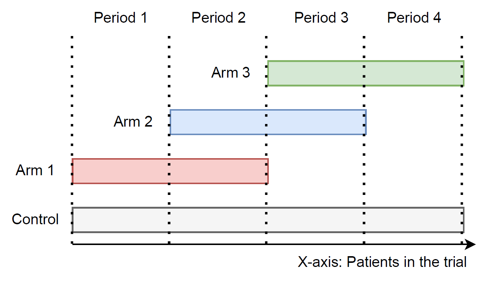

```{r setup, include = FALSE}
library(knitr)
opts_chunk$set(collapse = TRUE,
               comment = "#>",
               warning = FALSE,
               message = FALSE,
               fig.align = "center",
               out.width = "70%")
```

```{r, warning=FALSE, message=FALSE, include=FALSE}
library(tidyverse)
library(kableExtra)
library(latex2exp)
library(NCC)
set.seed(717)
```


# Introduction


The following toy simulation study aims to explore different model-based approaches to perform treatment-control comparisons using non-concurrent controls (NCC), as well as treatment-treatment comparisons for treatments that do not overlap in the platform trial. In the considered scenarios, continuous endpoints are assumed.


# Methods and goals

## Treatment-control comparisons

For treatment control comparisons, we will study 4 model-based methods differing in the way to adjust for time trend. In particular, we will examine two linear regression models that include time as fixed effect and two linear mixed models, where time enters the model as random effect. The considered adjustment is either for periods, defined as time intervals in the trial bounded by any treatment arm entering or leaving the platform, or for calendar time units (e.g. months). In all cases, data from the whole trial until the treatment arm under study finishes will be used to fit the model.

We aim to compare 1) the fixed and mixed effect models and 2) the adjustment for periods and for calendar times.


## Treatment-treatment comparisons

Treatment-treatment comparisons for non-concurrent treatments will be performed using indirect comparison, as well as a model based approach. In the indirect comparison, the treatment effects for both treatments are at first estimated using concurrent controls only. Subsequently, the estimated treatment effects are compared to each other using a t-test. The considered model-based approach is a fixed-effect model adjusting for periods and using one of the treatments under study as reference group.

We aim to compare the results from these two approaches in terms of the type I error and statistical power.


# Trial design

We consider a platform trial with 3 treatment arms, where 2 of them were added to the ongoing trial later on, such that the 3rd treatment arm is added at the same time as the 1st one finishes. The considered trial design is illustrated bellow.

For the treatment-control comparisons, we focus on statistical inference for the second and third treatment arms, as there are already NCC data available. Treatment-treatment comparison is performed for treatment arms 1 and 3, since they do not overlap in the trial.

In scenarios for treatment-control comparisons, we assume equal sample sizes of 3000 in all treatment arms and 1:1:...:1 allocation ratio in each period. Furthermore, we consider equal linear and stepwise time trends across all arms and simulate different scenarios varying the strength of the time trend indicated by $\lambda$ ($\lambda \in [-0.15; 0.15]$). The matrix with sample sizes in each arm and period in shown in Table 1. The resulting overall sample size is 15000. In scenarios for treatment-treatment comparisons, we reduced the sample size per arm to 300 patients.

For the calendar time adjustment, we assumed recruitment of 250 patients per calendar time unit, resulting in 60 calendar time units.

Moreover, we assumed effect sizes of $\theta_{2,3} = 0.075$ for the treatment-control comparisons under the alternative hypothesis. For treatment-treatment comparisons, effect sizes of $\theta_1 = 0.25$ in arm 1 and of $\theta_3 = 0.5$ in arm 3 were used for simulations under the alternative and $\theta_{1,3}=0.25$ under the null hypothesis.

```{r, echo=FALSE}
ss_mat <- get_ss_matrix(num_arms = 3, n_arm = 3000, d = c(0,3000,7500))
rownames(ss_mat) <- c("Control", "Arm 1", "Arm 2", "Arm 3")

kable(ss_mat, 
      col.names = c("Period 1", "Period 2", "Period 3", "Period 4"), caption = "Table 1: Sample size matrix for the considered trial design") %>%
  kable_styling(full_width = T) %>%
  column_spec(1, bold = T)
```


```{r, echo=FALSE}

```

```{r, echo=FALSE}
trial_data <- datasim_cont(num_arms = 3,
                           n_arm = 3000,
                           d = c(0,3000,7500),
                           period_blocks = 2,
                           mu0 = 0,
                           sigma = 1,
                           theta = c(0.25, 0, 0),
                           lambda = c(0, 0, 0, 0),
                           trend = "linear")

plot_trial(trial_data$treatment)
```


# Results


```{r, echo=FALSE}
results_i_eq_alpha <- read_csv("results/results_i_eq_alpha.csv")
results_i_eq_pow <- read_csv("results/results_i_eq_pow.csv")
```

## Treatment-control comparisons

Following section describes the results of treatment-control comparisons under different scenarios. For comparative purposes, results of the separate analysis (i.e. analysis using concurrent control data only) are shown in all plots as well.

### Fixed vs. mixed models

In scenarios with equal time trends across all arms, both, the separate analysis and the fixed effect models are able to maintain the type I error rate at 2.5%. Using the mixed model results in type I error inflation for positive time trends and deflation for negative time trends. The in- and deflation of the type I error is stronger for smaller $\lambda$ and decreases as the strength of the time trend increases. If there are no time trends present in the trial, the mixed model controls the type I error.

Using the model based approaches leads to increased statistical power as compared to the separate analysis, while under the scenario with no time trends, the highest power is achieved with the mixed model.

#### Period adjustment

##### Type I error

```{r, echo=FALSE}
ggplot(results_i_eq_alpha %>% filter(model %in% c("fixmodel", "mixmodel", "sepmodel"))) +
  geom_line(aes(lambda1, reject_h0, color=model, linetype=as.factor(study_arm))) +
  geom_point(aes(lambda1, reject_h0, color=model)) +
  labs(x=TeX("$\\lambda$"), y="Type I error", color="Analysis approach:", linetype="Inference for:") +
  geom_hline(aes(yintercept = 0.025), linetype = "dotted") +
  facet_grid(~ trend) +
  scale_color_discrete(labels = c("Fixmodel - periods", "Mixmodel - periods", "Separate analysis")) +
  scale_linetype_discrete(labels = c("Arm 2", "Arm 3"))
```

##### Power

```{r, echo=FALSE}
ggplot(results_i_eq_pow %>% filter(model %in% c("fixmodel", "mixmodel", "sepmodel"))) +
  geom_line(aes(lambda1, reject_h0, color=model, linetype=as.factor(study_arm))) +
  geom_point(aes(lambda1, reject_h0, color=model)) +
  labs(x=TeX("$\\lambda$"), y="Power", color="Analysis approach:", linetype="Inference for:") +
  facet_grid(~ trend) +
  scale_color_discrete(labels = c("Fixmodel - periods", "Mixmodel - periods", "Separate analysis")) +
  scale_linetype_discrete(labels = c("Arm 2", "Arm 3"))
```

#### Calendar time adjustment

##### Type I error

```{r, echo=FALSE}
ggplot(results_i_eq_alpha %>% filter(model %in% c("fixmodel_cal", "mixmodel_cal", "sepmodel"))) +
  geom_line(aes(lambda1, reject_h0, color=model, linetype=as.factor(study_arm))) +
  geom_point(aes(lambda1, reject_h0, color=model)) +
  labs(x=TeX("$\\lambda$"), y="Type I error", color="Analysis approach:", linetype="Inference for:") +
  geom_hline(aes(yintercept = 0.025), linetype = "dotted") +
  facet_grid(~ trend) +
  scale_color_discrete(labels = c("Fixmodel - calendar", "Mixmodel - calendar", "Separate analysis")) +
  scale_linetype_discrete(labels = c("Arm 2", "Arm 3"))
```

##### Power

```{r, echo=FALSE}
ggplot(results_i_eq_pow %>% filter(model %in% c("fixmodel_cal", "mixmodel_cal", "sepmodel"))) +
  geom_line(aes(lambda1, reject_h0, color=model, linetype=as.factor(study_arm))) +
  geom_point(aes(lambda1, reject_h0, color=model)) +
  labs(x=TeX("$\\lambda$"), y="Power", color="Analysis approach:", linetype="Inference for:") +
  facet_grid(~ trend) +
  scale_color_discrete(labels = c("Fixmodel - calendar", "Mixmodel - calendar", "Separate analysis")) +
  scale_linetype_discrete(labels = c("Arm 2", "Arm 3"))
```

### Period vs. calendar time adjustment

In the fixed effect models, adjusting for periods and calendar time units yield identical results. The mixed effect models adjusted for calendar time lead to larger type I error inflation than period-adjusted mixed models. 

#### Fixed effect

##### Type I error

```{r, echo=FALSE}
ggplot(results_i_eq_alpha %>% filter(model %in% c("fixmodel", "fixmodel_cal", "sepmodel"))) +
  geom_line(aes(lambda1, reject_h0, color=model, linetype=as.factor(study_arm))) +
  geom_point(aes(lambda1, reject_h0, color=model)) +
  labs(x=TeX("$\\lambda$"), y="Type I error", color="Analysis approach:", linetype="Inference for:") +
  geom_hline(aes(yintercept = 0.025), linetype = "dotted") +
  facet_grid(~ trend) +
  scale_color_discrete(labels = c("Fixmodel - periods", "Fixmodel - calendar", "Separate analysis")) +
  scale_linetype_discrete(labels = c("Arm 2", "Arm 3"))
```

##### Power

```{r, echo=FALSE}
ggplot(results_i_eq_pow %>% filter(model %in% c("fixmodel", "fixmodel_cal", "sepmodel"))) +
  geom_line(aes(lambda1, reject_h0, color=model, linetype=as.factor(study_arm))) +
  geom_point(aes(lambda1, reject_h0, color=model)) +
  labs(x=TeX("$\\lambda$"), y="Power", color="Analysis approach:", linetype="Inference for:") +
  facet_grid(~ trend) +
  scale_color_discrete(labels = c("Fixmodel - periods", "Fixmodel - calendar", "Separate analysis")) +
  scale_linetype_discrete(labels = c("Arm 2", "Arm 3"))
```

#### Mixed effect

##### Type I error

```{r, echo=FALSE}
ggplot(results_i_eq_alpha %>% filter(model %in% c("mixmodel", "mixmodel_cal", "sepmodel"))) +
  geom_line(aes(lambda1, reject_h0, color=model, linetype=as.factor(study_arm))) +
  geom_point(aes(lambda1, reject_h0, color=model)) +
  labs(x=TeX("$\\lambda$"), y="Type I error", color="Analysis approach:", linetype="Inference for:") +
  geom_hline(aes(yintercept = 0.025), linetype = "dotted") +
  facet_grid(~ trend) +
  scale_color_discrete(labels = c("Mixmodel - periods", "Mixmodel - calendar", "Separate analysis")) +
  scale_linetype_discrete(labels = c("Arm 2", "Arm 3"))
```


##### Power


```{r, echo=FALSE}
ggplot(results_i_eq_pow %>% filter(model %in% c("mixmodel", "mixmodel_cal", "sepmodel"))) +
  geom_line(aes(lambda1, reject_h0, color=model, linetype=as.factor(study_arm))) +
  geom_point(aes(lambda1, reject_h0, color=model)) +
  labs(x=TeX("$\\lambda$"), y="Power", color="Analysis approach:", linetype="Inference for:") +
  facet_grid(~ trend) +
  scale_color_discrete(labels = c("Mixmodel - periods", "Mixmodel - calendar", "Separate analysis")) +
  scale_linetype_discrete(labels = c("Arm 2", "Arm 3"))
```


## Treatment-treatment comparisons

For treatment-treatment comparisons, both investigated methods (indirect comparison and regression model adjusting for periods) are able to control the type I error in scenarios with equal time trends across all arms, regardless of the strength and pattern of the time trend. The regression model, however, substantially improves the statistical power as compared to the indirect comparison, as it additionally uses data from the 2nd treatment arm and estimates the period effect.

```{r, echo=FALSE}
TT_results_i_eq_alpha <- read_csv("results/TT_results_i_eq_alpha.csv")
TT_results_i_eq_pow <- read_csv("results/TT_results_i_eq_pow.csv")
```


```{r, echo=FALSE}
ggplot(TT_results_i_eq_alpha) +
  geom_line(aes(lambda1, reject_h0, color=model)) +
  geom_point(aes(lambda1, reject_h0, color=model)) +
  labs(x=TeX("$\\lambda$"), y="Type I error", color="Analysis approach:") +
  geom_hline(aes(yintercept = 0.025), linetype = "dotted") +
  facet_grid(~ trend) +
  scale_color_discrete(labels = c("Fixmodel", "Indirect comp."))
```


```{r, echo=FALSE}
ggplot(TT_results_i_eq_pow) +
  geom_line(aes(lambda1, reject_h0, color=model)) +
  geom_point(aes(lambda1, reject_h0, color=model)) +
  labs(x=TeX("$\\lambda$"), y="Power", color="Analysis approach:") +
  facet_grid(~ trend) +
  scale_color_discrete(labels = c("Fixmodel", "Indirect comp."))
```


